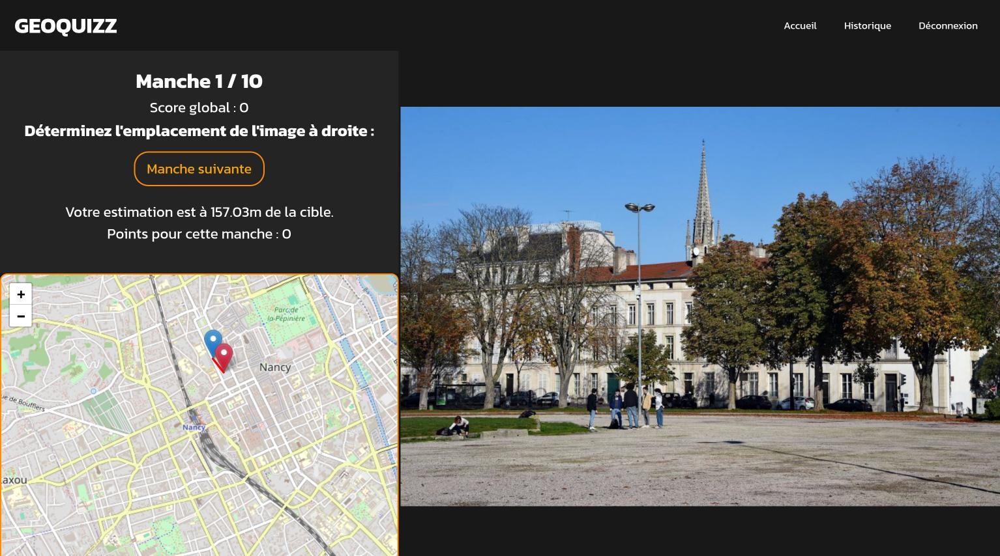
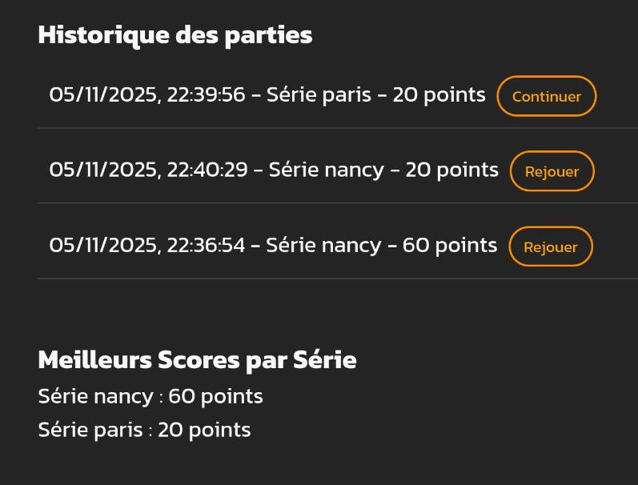

# SAE Geoquizz
## Présentation
Géoquizz est un site de jeu ou le but est de deviner l'emplacement de photos sur une carte le plus rapidement possible (style geoguessr).
Les photos sont organisées par ville.
On lance une partie en choisissant une ville, on doit ensuite deviner l'emplacement de plusieurs 
photos choisi aléatoirement dans les photos disponible pour cette ville.
Plus l'emplacement qu'on choisi est proche de la photo plus on gagne de points.
Il y a aussi un temps limite au dela duquel on ne gagne plus aucun points.  
Les scores des parties sont sauvegardés et affichés.
Si on quitte une partie en cours on peut la rejoindre quand on veut.

## Architecture
Les photos et les informations des séries disponibles sont géré par Directus, un CMS Headless.  
Cela permet de gerer les séries et les photos sans avoir à construire de platforme dédié.

Un service d'authentification qui s'occupe de la connexion et la création de comptes.  
Un service de jeu qui s'occupe de la gestion des parties.  
Un service d'envoi de mail de manière asynchrone à l'aide d'une queue de message.  
Ces trois services sont exposé au travers d'une api "gateway" 
pour n'avoir qu'une seul adresse à laquel on fait toute nos requêtes.  
Ces services sont fait en PHP, en utilisant 
[Slim](https://www.slimframework.com/) pour le routage, 
[Doctrine](https://www.doctrine-project.org/) comme orm et 
[PHP-DI](https://php-di.org/) pour l'injection de dépendence.
L'auth et le jeu ont leur propres base de donnée.

La partie web est une SPA (Single Page Application) faite avec [Vue-js](https://vue-js.org),
qui fait des requêtes à la gateway.

### Contexte
Réalisé pour une SAE (projet de groupe noté) en 3ème année de BUT Informatique Développement Web et Mobile.
L'un des buts était de pratiquer l'utilisation de microservices, même si pas forcément utile ou pratique.

## Images

## Groupe
- Sasha DAZA
- Mathis PEROT
- Gaëtan PINOT
- Yehor PRYKHODKO

## Fonctionnalités
- Frontend 
    - Style : Sasha et Mathis
    - Fonctionnalités : Mathis
        - Gestion de la création d'une partie : Mathis
        - Jouer un coup et voir la différence entre l'estimation et la réalite : Mathis
        - Voir l'historique du joueur connécté : Mathis
- Backend 
    - Gateway : Gaëtan
    - Auth : Gaëtan 
    - Directus : Gaëtan
    - Service de mailer + file de message : Gaëtan
    - Fonctionnalités de jeux : Yehor
        - Token unique à la partie : Gaëtan
        - Création des parties : Yehor
        - Jouer une partie : Yehor
        - Historique des parties d'un joueur : Yehor
- Deployment sur Docketu: Gaëtan

## URLS:
- [Frontend](http://docketu.iutnc.univ-lorraine.fr:12100)
- [Mailcatcher](http://docketu.iutnc.univ-lorraine.fr:12107)
- [Gateway](http://docketu.iutnc.univ-lorraine.fr:12101)
- [Directus](http://docketu.iutnc.univ-lorraine.fr:12102)

## Installation
Il faut copier les fichiers `*env.dist` en `*env`  
Il y a un script `cpenv.sh` qui copie les fichiers `.env` nécéssaire pour un fonctionnement basique.
Le fichier `.env` contient les ports sur lequel seront déployé l'application.  
Certain fichier d'env contienne des secret pour encoder du jwt ou des tokens pour acceder a des application.
Il sera peut être nécéssaire de modifier certaines valeurs pour que l'application fonctionne bien.

Executer `./install.bash`  
Puis créer la base de donnée avec `./db.sh`
